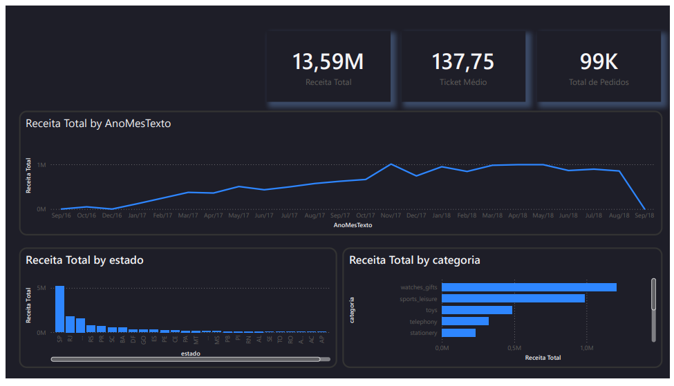
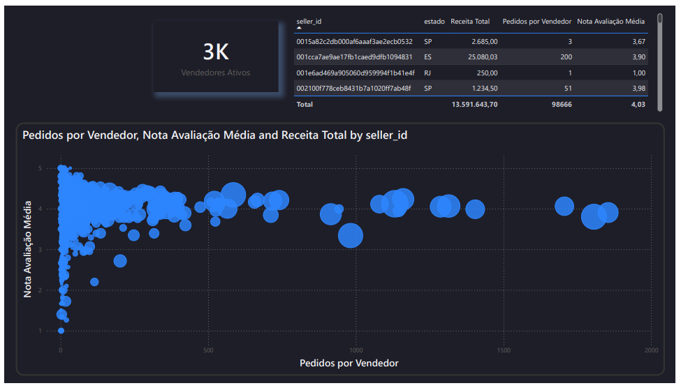
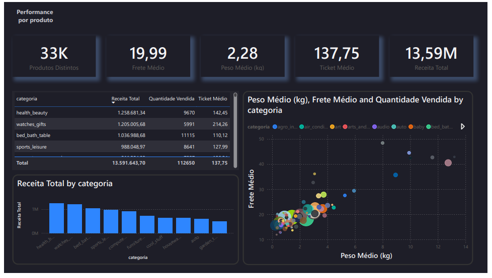
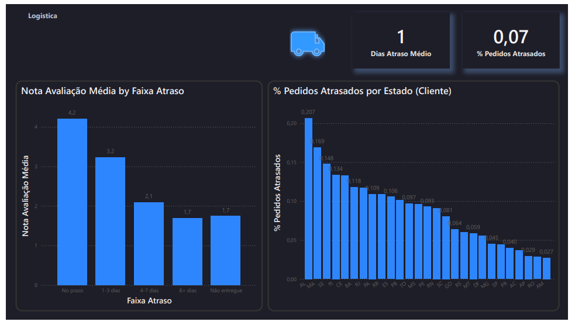

# Dashboard de Performance Comercial

## Sobre o projeto

Pipeline de dados completo — da modelagem dimensional à visualização — construído para analisar performance comercial de um e-commerce: vendas, vendedores, produtos e logística de entrega. Usa o dataset público [Olist Brazilian E-Commerce](https://www.kaggle.com/datasets/olistbr/brazilian-ecommerce), com todo o ETL escrito em SQL puro (Postgres) e o dashboard final em PowerBI.

O objetivo não foi só "conectar dado a gráfico" — cada página do dashboard responde a uma pergunta de negócio específica, e as descobertas mais relevantes estão documentadas na seção **Principais achados** abaixo.

## Status

✅ Concluído (Sprint 2, Docker, ficou de fora por decisão consciente — ver Roadmap)

## Stack

- PostgreSQL nativo (modelo dimensional — star schema)
- SQL puro para ETL (staging → dimensões → fato)
- PowerBI (camada de visualização, tema customizado dark)

## Estrutura

```
sql/            scripts de criação e carga do banco (star schema)
data/           CSVs do Olist (não versionado — ver instruções abaixo)
dashboard/      arquivo PowerBI (.pbix), PDF exportado e tema customizado (.json)
```

## Como reproduzir

1. Baixe os CSVs do [Olist no Kaggle](https://www.kaggle.com/datasets/olistbr/brazilian-ecommerce) e coloque em `data/`.
2. Rode os scripts em `sql/` na ordem numérica (`00` cria a base, `01` o schema, `02` a staging, `\copy` carrega os CSVs, `03`-`05` populam dimensões e fato).
3. Abra o `.pbix` em `dashboard/`, aponte a conexão pro seu Postgres local e aplique o tema `theme_performance_comercial.json`.

Não tem PowerBI instalado? O PDF exportado em `dashboard/` mostra todas as páginas sem precisar rodar nada.

## O dashboard

### Visão Geral
KPIs de receita, evolução mensal, concentração geográfica e top categorias.



### Performance por Vendedor
Ranking de vendedores e relação entre volume de pedidos e nota de avaliação.



### Performance por Produto
Receita e ticket médio por categoria, relação entre peso do produto e frete.



### Logística
Impacto do atraso de entrega na avaliação do cliente, por faixa de atraso e por estado de destino.



## Principais achados

- Concentração geográfica de receita em SP, RJ e MG, refletindo o perfil do e-commerce brasileiro.
- Nota média de avaliação cai de ~4,1 (pedidos no prazo) para ~1,7 (8+ dias de atraso) — atraso na entrega tem impacto direto e mensurável na satisfação do cliente.
- Apenas 3,05% dos clientes fizeram mais de um pedido, mas esse grupo recorrente gasta quase o dobro por cliente (R$262 vs. R$138 dos não recorrentes) — sinaliza oportunidade de retenção, já que reter um cliente recorrente vale mais que adquirir um novo.
- O estado de destino do cliente pesa muito mais no atraso que o estado do vendedor: pedidos para AL e MA chegam atrasados em ~19-21% dos casos (nota ~3,7), contra ~4% em SP/MG/PR (nota >4,1) — o gargalo é logística de distância (Norte/Nordeste), não a operação dos vendedores.

## Notas de qualidade de dado

- 610 produtos (1.603 itens vendidos, ~1,3% da receita total) não possuem `product_category_name` na origem do dataset Olist e aparecem como `unknown` na dimensão de produto — limitação do próprio dataset, não do ETL.

## Roadmap

- [x] Sprint 1 — Modelagem dimensional + ETL em SQL (staging → dimensões → fato, validado)
- [ ] Sprint 2 — Containerização (Docker) — **adiada**; Postgres nativo no Windows é suficiente por ora
- [x] Sprint 3 — Dashboard PowerBI (4 páginas: Visão Geral, Vendedor, Produto, Logística — tema dark customizado)
- [x] Sprint 4 — Analytics avançado (categoria unknown, vendedor outlier, recorrência de cliente, atraso por região)
- [x] Sprint 5 — Publicação no portfólio
